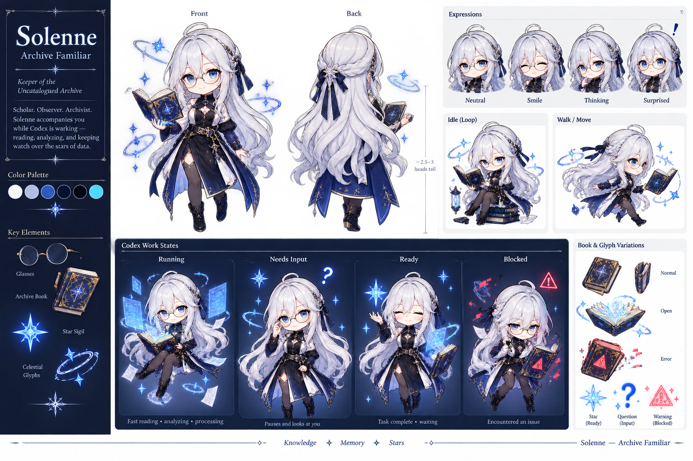

# Solenne — Archive Familiar

[简体中文](README.zh-CN.md)

Solenne is a custom animated Codex pet: a calm celestial scholar, archivist, and observer who quietly reads and works beside you.



## Highlights

- Polished anime-style SD/chibi design with a mature scholar personality
- Long silver-white hair, round glasses, blue eyes, navy scholarly outfit, and celestial archive book
- Nine standard Codex animation states
- Sixteen clockwise look directions
- Transparent, lossless WebP spritesheet
- Codex v2 pet format (`spriteVersionNumber: 2`)

## Quick install

Copy these two files from `pet/solenne/` into your local Codex pet directory:

```text
pet.json
spritesheet.webp
```

Destination:

- Windows: `%USERPROFILE%\.codex\pets\solenne\`
- macOS/Linux: `~/.codex/pets/solenne/`

Restart the desktop app if the pet list does not refresh immediately. See [INSTALL.md](INSTALL.md) for complete instructions.

## Animation states

| State | Purpose |
| --- | --- |
| `idle` | Calm reading, breathing, and blinking |
| `running-right` | Moving toward screen-right |
| `running-left` | Moving toward screen-left |
| `waving` | Restrained greeting |
| `jumping` | Light jump or hover |
| `failed` | Mildly concerned error reaction |
| `waiting` | Waiting for approval or user input |
| `running` | Active reading, analysis, and processing |
| `review` | Reviewing completed work |

Rows 9–10 contain sixteen clockwise look directions, from `000` (up) through `337.5` (up-left).

## Package layout

```text
Solenne-Codex-Pet-v1.0.0/
├── pet/solenne/
│   ├── pet.json
│   └── spritesheet.webp
├── previews/
│   ├── solenne-overview.png
│   ├── contact-sheet.png
│   ├── look-directions.png
│   └── animations/*.gif
├── README.md
├── README.zh-CN.md
├── INSTALL.md
├── INSTALL.zh-CN.md
├── QA.md
├── LICENSE.md
└── SHA256SUMS.txt
```

## Technical specification

- Atlas: `1536 × 2288`
- Grid: `8 × 11`
- Cell size: `192 × 208`
- Format: lossless RGBA WebP
- Pet ID: `solenne`
- Sprite version: `2`

The release atlas passed structural validation with no errors or warnings. See [QA.md](QA.md).

## License

This is a custom, non-open-source personal-use release. Personal non-commercial use, screenshots, videos, and redistribution of the original unmodified release are permitted under the conditions in [LICENSE.md](LICENSE.md). Commercial use, resale, derivative pet packages, and AI/model-training use require separate permission.

## Credits and disclosure

Solenne's character identity is based on original concept art supplied by the creator. The Codex pet sprites, atlas assembly, validation, and release packaging were created with Codex and image-generation tooling under creator direction.
